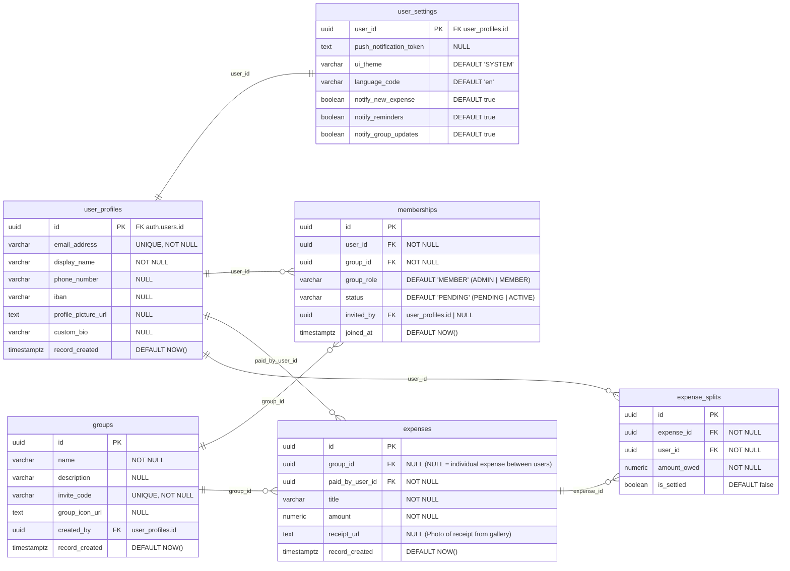

# boilerplate

```mermaid
erDiagram
    direction LR

    user_profiles ||--|| user_settings : "user_id"
    user_profiles ||--o{ memberships : "user_id"
    groups ||--o{ memberships : "group_id"
    groups ||--o{ expenses : "group_id"
    user_profiles ||--o{ expenses : "paid_by_user_id"
    expenses ||--o{ expense_splits : "expense_id"
    user_profiles ||--o{ expense_splits : "user_id"

    user_profiles {
        uuid id PK "FK auth.users.id"
        varchar email_address "UNIQUE, NOT NULL"
        varchar display_name "NOT NULL"
        varchar phone_number "NULL"
        varchar iban "NULL"
        text profile_picture_url "NULL"
        varchar custom_bio "NULL"
        timestamptz record_created "DEFAULT NOW()"
    }

    user_settings {
        uuid user_id PK "FK user_profiles.id"
        text push_notification_token "NULL"
        varchar ui_theme "DEFAULT 'SYSTEM'"
        varchar language_code "DEFAULT 'en'"
        boolean notify_new_expense "DEFAULT true"
        boolean notify_reminders "DEFAULT true"
        boolean notify_group_updates "DEFAULT true"
    }

    groups {
        uuid id PK
        varchar name "NOT NULL"
        varchar description "NULL"
        varchar invite_code "UNIQUE, NOT NULL"
        text group_icon_url "NULL"
        uuid created_by FK "user_profiles.id"
        timestamptz record_created "DEFAULT NOW()"
    }

    memberships {
        uuid id PK
        uuid user_id FK "NOT NULL"
        uuid group_id FK "NOT NULL"
        varchar group_role "DEFAULT 'MEMBER' (ADMIN | MEMBER)"
        varchar status "DEFAULT 'PENDING' (PENDING | ACTIVE)"
        uuid invited_by FK "user_profiles.id | NULL"
        timestamptz joined_at "DEFAULT NOW()"
    }

    expenses {
        uuid id PK
        uuid group_id FK "NULL (NULL = individual expense between users)"
        uuid paid_by_user_id FK "NOT NULL"
        varchar title "NOT NULL"
        numeric amount "NOT NULL"
        text receipt_url "NULL (Photo of receipt from gallery)"
        timestamptz record_created "DEFAULT NOW()"
    }

    expense_splits {
        uuid id PK
        uuid expense_id FK "NOT NULL"
        uuid user_id FK "NOT NULL"
        numeric amount_owed "NOT NULL"
        boolean is_settled "DEFAULT false"
    }
```
